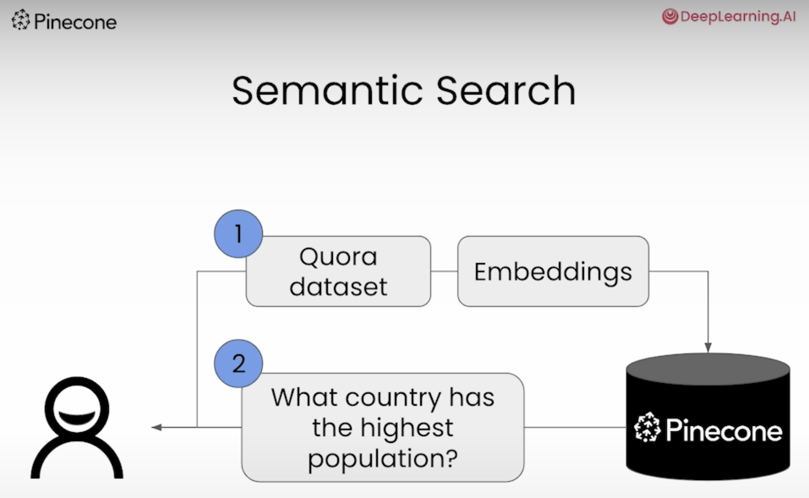

# [DeepLearning.AI] Buildings Applications with Vector Databases course

Personal notes and code for the **DeepLearning.AI** course [Building Applications with Vector Databases](https://www.deeplearning.ai/short-courses/building-applications-vector-databases/).

## Requirements

* Python 3.10+
* Poetry
* Pinecone API Key

### Getting Started

1. **Install dependencies:**
```bash
poetry install
```

2. **Set up environment variables:**

Create a .env file in the root directory of the project.
Add the following environment variables to the .env file:
```
PINECONE_API_KEY=<Pinecone API Key>
```

3. Run the desired notebook.

# Lesson 1: Semantic Search

Semantic search is a type of search that focuses on the meaning of the content being searched, as opposed to lexical search, which looks for literal matches or pattern-matched strings.

This is an extremely powerful concept that underlies much of what we see in text-oriented generative AI applications.



📝 **Notebook:** [01_semantic_search.ipynb](./notebooks/01_semantic_search.ipynb)

## Lesson 2: Retrieval Augmented Generation (RAG)

The RAG (Retrieval-Augmented Generation) system is a method that combines retrieval of relevant documents or data from an external source with the generation of natural language responses, usually via a generative model. Here’s a simplified breakdown:

* **Retrieval:** The system first searches a database or document corpus to fetch relevant pieces of information based on a user's query.
* **Augmented Generation:** It then uses a generative model to generate a response, but instead of purely relying on what it has been trained on, it incorporates the retrieved information to create a more accurate and contextually relevant answer.

This system is particularly useful for enhancing the accuracy and specificity of AI-generated responses, as it can access up-to-date or domain-specific information from external sources.


📝 **Notebook:** *Coming soon...*

## Lesson 3: Recommender Systems

*Coming soon...*

## Lesson 4: Hybrid Search

*Coming soon...*

## Lesson 5: Facial Similarity Search

*Coming soon...*

## Lesson 6: Anomaly Detection

*Coming soon...*

### Contributions

This repository is created to be used as a companion for the DeepLearning.AI course [Building Applications with Vector Databases](https://www.deeplearning.ai/short-courses/building-applications-vector-databases/). Feel free to use it to learn about the course content and as a reference for future projects.